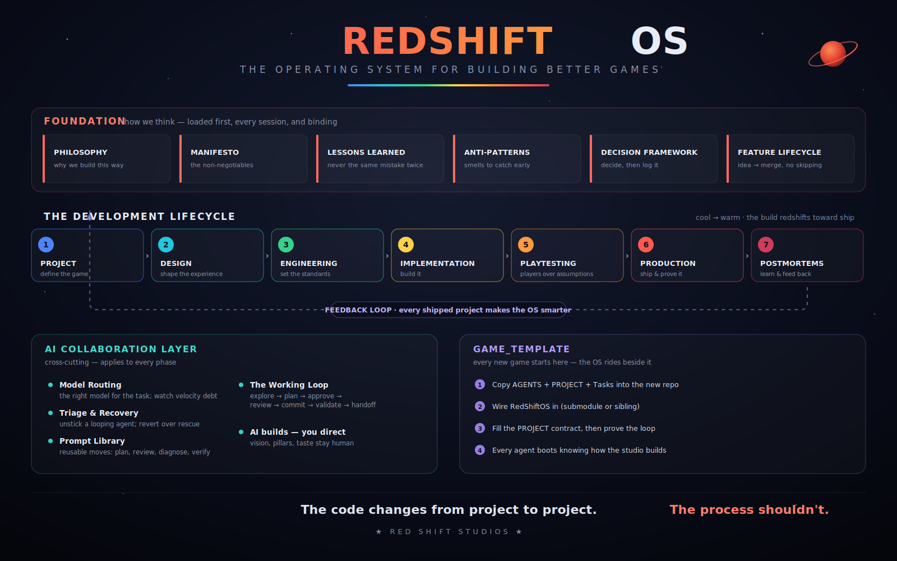

# RedShiftOS

**The operating system for building better games — an AI-first process for planning,
architecting, building, testing, and shipping.**



RedShiftOS is not a game and not an engine. It is the repeatable development *process* —
philosophy, engineering rules, production workflow, and AI-collaboration standards — that
lives beside every game Red Shift Studios makes. **The code changes from project to project.
The process shouldn't.**

It exists because of one lesson from the first game (Cart Clash): every time an AI agent
implemented a feature, it only knew about *that feature*. It didn't know the long-term
vision, the design pillars, the architectural intent, or the lessons already learned. So
every implementation was locally optimal and globally expensive.

RedShiftOS is the shared context that fixes that. Before an agent touches a new game's
source tree, it reads this repository first — and now it knows *how Red Shift Studios builds
games*, not just *today's prompt*.

## How it's used

1. **Load the Manifesto + `AGENTS.md`'s task map** — then pull the rest of `FOUNDATION/` *by
   task*. Don't boot-load the whole library; more context dilutes signal.
2. **Move through the lifecycle phases** as you build — Project → Design → … → Postmortems
   (`LIFECYCLE/`).
3. **Non-trivial features run the [Feature Lifecycle](FOUNDATION/Feature-Lifecycle.md)** — pick
   the task class, run its gates.
4. **Every significant decision** runs the [Decision Framework](FOUNDATION/Decision-Framework.md)
   and gets logged (game-specific ones live in the game repo).
5. **Every shipped project's pain** feeds back into
   [Lessons Learned](FOUNDATION/Lessons-Learned.md) and
   [Anti-Patterns](FOUNDATION/Anti-Patterns.md). The system gets smarter because we actually
   shipped with it.

## What's inside

- **[FOUNDATION/](FOUNDATION/)** — how we think: [Philosophy](FOUNDATION/Studio-Philosophy.md)
  (the *why*), [Manifesto](FOUNDATION/Development-Manifesto.md) (the *what*),
  [Lessons Learned](FOUNDATION/Lessons-Learned.md), [Anti-Patterns](FOUNDATION/Anti-Patterns.md),
  [Decision Framework](FOUNDATION/Decision-Framework.md), and the
  [Feature Lifecycle](FOUNDATION/Feature-Lifecycle.md).
- **[LIFECYCLE/](LIFECYCLE/)** — the seven phases; folders exist where content does, the rest
  are covered by FOUNDATION until a game fills them.
- **[AI/](AI/)** — the cross-cutting AI-collaboration layer: model routing, triage & recovery,
  prompt library.
- **[GAME_TEMPLATE/](GAME_TEMPLATE/)** — copy into a new game repo to wire it to this OS.
- **[ROADMAP.md](ROADMAP.md)** — where this is headed (the automation endgame — recorded, not
  yet built).

## Structure

```
RedShiftOS/
├── README.md
├── AGENTS.md              ← canonical agent rules; read first, every session
├── CLAUDE.md              ← thin pointer to AGENTS.md (Claude Code reads this)
├── ROADMAP.md             ← where this is headed
├── FOUNDATION/            how we think — loaded first, applies to every phase
│   ├── Studio-Philosophy.md
│   ├── Development-Manifesto.md
│   ├── Lessons-Learned.md
│   ├── Anti-Patterns.md
│   ├── Decision-Framework.md
│   └── Feature-Lifecycle.md
├── LIFECYCLE/             the 7 phases (folders exist where content does — see LIFECYCLE/README)
│   ├── 1-PROJECT/         define the game
│   ├── 4-IMPLEMENTATION/  build it (+ Session-Handoffs.md)
│   └── 6-PRODUCTION/      ship it (+ Assets-and-Provenance.md)
├── AI/                    cross-cutting AI-collaboration layer
│   ├── Model-Routing.md
│   ├── Triage-and-Recovery.md
│   └── Prompt-Library.md
└── GAME_TEMPLATE/         copy into a new game repo to wire it to this OS
    ├── AGENTS.md
    ├── PROJECT.md
    ├── Tasks.md
    └── README.md
```

## The system eats its own dogfood

RedShiftOS is built using RedShiftOS. Its changes run through the same Feature Lifecycle and
Decision Framework it prescribes, and its structural calls are logged in the Decision
Framework. If the process feels cumbersome while building the OS, it would feel cumbersome
while building a game — and that's the signal to fix the process, not to skip it.

---

*Status: **frozen — validating on Game #2.** After a critical review, the always-load design
was thinned to a Manifesto + a task map (FOUNDATION is now a reference library pulled by task),
the feature pipeline got honest task classes, the dual catalog collapsed to one narrative + one
checklist, and the empty phase folders were removed. The earned content — 17 lessons, the
philosophy, the proof ladder — is untouched. Game #2 is the experiment that tells us what to
add next; success metrics are in [ROADMAP.md](ROADMAP.md). No OS expansion until then.*
